# Async-UART-Controller

A multi-clock-domain digital system written in Verilog/SystemVerilog. A host talks to it over a UART link; the system decodes command frames, reads and writes a register file, runs arithmetic and logic operations on an ALU, and sends the results back over UART. The design crosses between two asynchronous clock domains using dedicated CDC structures and is taken through simulation, synthesis, DFT scan insertion, place and route, formal equivalence checking and CDC/lint sign-off.

---

## Table of contents

1. [Highlights](#1-highlights)
2. [System architecture](#2-system-architecture)
3. [Repository layout](#3-repository-layout)
4. [Clocks, resets and baud-rate math](#4-clocks-resets-and-baud-rate-math)
5. [Top-level interface](#5-top-level-interface)
6. [Register file and register map](#6-register-file-and-register-map)
7. [Command protocol](#7-command-protocol)
8. [UART frame format](#8-uart-frame-format)
9. [Block-by-block description](#9-block-by-block-description)
10. [ALU function table](#10-alu-function-table)
11. [SYS_CTRL state machine](#11-sys_ctrl-state-machine)
12. [Clock-domain-crossing strategy](#12-clock-domain-crossing-strategy)
13. [Verification](#13-verification)
14. [Backend flow and results](#14-backend-flow-and-results)
15. [How to run](#15-how-to-run)
16. [Known limitations and notes](#16-known-limitations-and-notes)
17. [Tools](#17-tools)
18. [Credits](#18-credits)

---

## 1. Highlights

- **Two asynchronous clock domains**: `REF_CLK` (50 MHz) and `UART_CLK` (3.6864 MHz).
- **Configurable UART** (8 data bits, optional parity, 1 stop bit) with a run-time programmable prescale and baud divider.
- **Command-driven system controller**: register write, register read, ALU with operands, ALU without operands.
- **8x16 register file** with the UART configuration held in two registers.
- **ALU with 15 functions** (add, subtract, multiply, divide, bitwise, compare, shifts) and a **clock-gated** clock so it only toggles when enabled.
- **Asynchronous FIFO** (8 entries, Gray-coded pointers, 2-flop synchronizers) for the response path.
- **Dedicated CDC blocks**: data synchronizer with enable handshake, reset synchronizers, pulse generator.
- **Full backend flow**: ModelSim testbench (5/5 pass), Design Compiler synthesis, DFT scan insertion (99.45 % test coverage), Cadence place and route (DRC, connectivity and antenna clean, setup and hold met), Formality equivalence (all compare points pass) and SpyGlass lint/CDC.

---

## 2. System architecture

The block diagram below is the system architecture from the project report and specification (Figure 1 of the report):

<p align="center">
  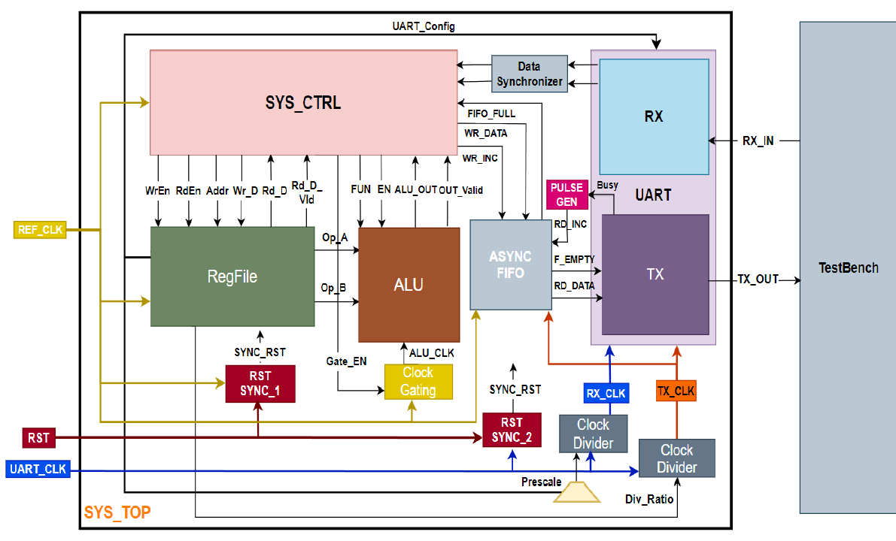
  <br><sub><b>SYS_TOP block diagram: two clock domains, reset synchronizers, data synchronizer and asynchronous FIFO</b></sub>
</p>

The same design redrawn as a data-path view, with the two clock domains shaded and the only two data crossings highlighted:

<p align="center">
  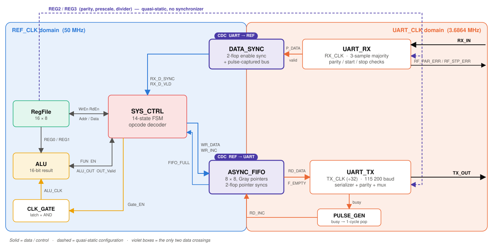
  <br><sub><b>Data path and clock-domain crossings (generated from the RTL hierarchy)</b></sub>
</p>

Clock and reset generation at a glance:

- `UART_CLK` → `ClkDiv` (RX) → `RX_CLK`, and `UART_CLK` → `ClkDiv` (TX, ÷ `REG3`) → `TX_CLK`.
- `REF_CLK` → `CLK_GATE` → `ALU_CLK`.
- `RST` → one `RST_SYNC` per domain → `SYNC_REF_RST` / `SYNC_UART_RST`.

The flow of one command:

1. The host sends a frame on `RX_IN`. `UART_RX` oversamples and deserializes it, checks the start, parity and stop bits and produces an 8-bit word plus `data_valid` in the RX domain.
2. `DATA_SYNC` safely moves the word into the `REF_CLK` domain (2-flop synchronizer on the enable, edge-detected pulse captures the data bus).
3. `SYS_CTRL` decodes the opcode, performs the register or ALU operation, and, if a response is needed, pushes bytes into the `ASYNC_FIFO`.
4. The FIFO crosses back into the `TX_CLK` domain. `UART_TX` sends the bytes on `TX_OUT`, one frame at a time.

---

## 3. Repository layout

```
Async-UART-Controller/
├── README.md
├── Final_System.pdf                 # 15-page system specification
├── RTL/
│   ├── ALU/ALU.v
│   ├── ASYNC_FIFO/                  # ASYNC_FIFO.v, DF_SYNC.v, FIFO_MEM_CNTRL.v, FIFO_RD.v, FIFO_WR.v
│   ├── CLKDIV_MUX/CLKDIV_MUX.v
│   ├── CLK_Divider/ClkDiv.v
│   ├── Clock_Gating/CLK_GATE.v
│   ├── DATA_SYNC/DATA_SYNC.v
│   ├── PULSE_GEN/PULSE_GEN.v
│   ├── RST_SYNC/RST_SYNC.v
│   ├── RegFile/RegFile.v
│   ├── SYS_CTRL/SYS_CTRL.v
│   ├── SYS_TOP/                     # SYS_TOP.v (functional top), SYS_TOP_dft.v (DFT-ready top),
│   │                                # SYS_TOP_dft_pnr.v (DFT top with renamed ports for place and route)
│   ├── mux2X1/mux2X1.v
│   └── UART/
│       ├── UART_TOP/UART.v
│       ├── UART_RX/                 # UART_RX_TOP.v, UART_RX_FSM.sv, edge_bit_counter.v,
│       │                            # data_sampling.v, deserializer.v, parity_Check.v,
│       │                            # strt_Check.v, stop_Check.v
│       └── UART_TX/                 # UART_TX_TOP.v, UART_TX_FSM.sv, Serializer.v,
│                                    # parity_Calc.v, Mux_4X1.v
├── docs/
│   ├── images/                      # figures used by this README (diagrams, charts, waveforms)
│   └── tools/                       # Python scripts that regenerate the diagrams and charts
├── TB/
│   └── SYS_TB.sv                    # self-checking testbench (module SYS_TOP_tb)
├── Backend/
│   ├── Synthesis/                   # cons.tcl, syn_script.tcl, run_syn.sh, system.lst,
│   │                                # log/, netlists/, reports/
│   ├── DFT/                         # cons.tcl, dft_script.tcl, run_dft.sh, system.lst,
│   │                                # log/, netlists/, reports/
│   └── Formality/
│       ├── post-syn/                # RTL vs post-synthesis netlist
│       ├── post-dft/                # RTL vs post-DFT netlist
│       └── post-PnR/                # template only (not populated)
├── System_pnr/
│   ├── DFT/                         # DFT run on SYS_TOP_dft_pnr.v: netlist, SDC for 3 modes, SDF, SVF, reports
│   ├── pnr/                         # Encounter project: des_import / floorplan / placement / cts /
│   │                                # routing / chip_finish / outputs_gen .tcl, saved .enc databases, logs
│   └── std_cells/                   # library, LEF and cap-table inputs used by the PnR flow
├── PnR/                             # exported PnR results: netlist, SDF, SPF, GDS, timing reports
└── Results/
    ├── ModelSim waveform exports (TC1 – TC5)
    ├── SYS_TOP_Project_Report.pdf / .docx    # 23-page project report
    ├── Synthesis.png, TB_Transcript.png
    ├── Layout/                               # Layout.png and Encounter screenshots (floorplan, placement, amoeba)
    └── Spyglass_Results/consolidated_reports/
```

Total RTL + testbench: roughly 2,250 lines across 32 source files.

---

## 4. Clocks, resets and baud-rate math

<p align="center">
  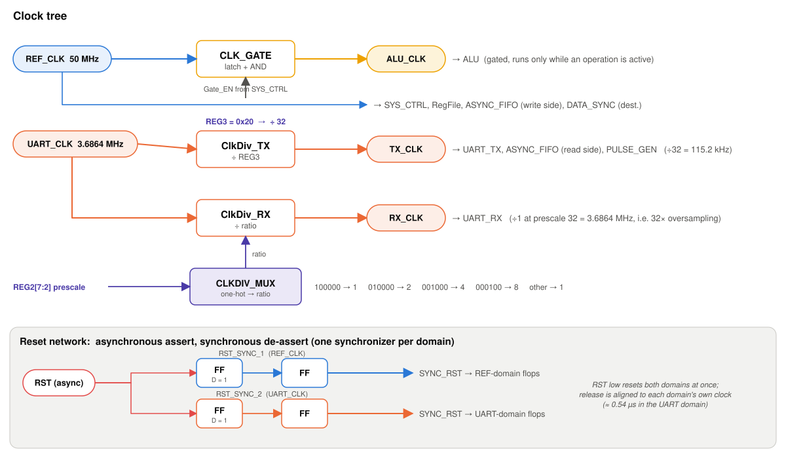
  <br><sub><b>Clock tree and reset network</b></sub>
</p>

### Clocks

| Clock | Frequency | Period | Source |
|---|---|---|---|
| `REF_CLK` | 50 MHz | 20 ns | primary input |
| `UART_CLK` | 3.6864 MHz | 271.2968 ns | primary input |
| `TX_CLK` | UART_CLK ÷ REG3 = ÷32 → **115.2 kHz** | 8.68 µs | `ClkDiv` (TX) |
| `RX_CLK` | UART_CLK ÷ RX ratio (÷1 at prescale 32) → 3.6864 MHz | 271.3 ns | `ClkDiv` (RX) via `CLKDIV_MUX` |
| `ALU_CLK` | `REF_CLK`, gated | 20 ns | `CLK_GATE` |

### Baud-rate arithmetic

- `UART_CLK` = 3.6864 MHz = 32 × 115,200.
- TX divides `UART_CLK` by `REG3` (default `0x20` = 32) → 115.2 kHz, one TX clock per bit → **115,200 baud**, bit period ≈ 8.68 µs.
- RX uses prescale (`REG2[7:2]`, default 32) as its oversampling factor. `CLKDIV_MUX` maps the one-hot prescale to the RX divider ratio:

| `REG2[7:2]` (prescale) | RX divider ratio |
|---|---|
| `100000` (32) | 1 |
| `010000` (16) | 2 |
| `001000` (8) | 4 |
| `000100` (4) | 8 |
| other | 1 |

At prescale 32 the RX clock runs at 32× the baud rate; each bit is sampled across 32 RX clock edges.

### Clock divider behaviour (`ClkDiv`)

- Ratio 0 (or divider disabled) → output held at 0.
- Ratio 1 → bypass: output is the input clock.
- Otherwise → counter-based division; the high phase length is `ratio >> 1`, handling odd and even ratios.

### Clock gate (`CLK_GATE`)

Latch-based glitch-free gate: a latch that is transparent while the clock is low captures `CLK_EN`, then ANDs with `CLK`. The behavioural model is used for simulation; the synthesis library cell `TLATNCAX12M` is left in a commented block in the RTL and is what the synthesized netlist instantiates.

### Resets

An asynchronous, active-low `RST` is brought into each domain through a 2-flop `RST_SYNC`: **asynchronous assertion, synchronous de-assertion**. The two outputs (`SYNC_REF_RST`, `SYNC_UART_RST`) reset their respective domains. In the UART domain the release takes about 0.54 µs (two 271 ns cycles).

---

## 5. Top-level interface

Module `SYS_TOP` (functional), `SYS_TOP_dft` (adds scan ports) and `SYS_TOP_dft_pnr` (same as the DFT version, with renamed functional ports for place and route).

| Port | Dir | Description |
|---|---|---|
| `REF_CLK` | in | 50 MHz reference clock |
| `UART_CLK` | in | 3.6864 MHz UART clock |
| `RST` | in | asynchronous active-low reset |
| `RX_IN` | in | serial receive line |
| `TX_OUT` | out | serial transmit line |
| `RF_PAR_ERR` | out | parity error flag from the receiver |
| `RF_STP_ERR` | out | stop-bit error flag from the receiver |

The DFT version adds `scan_clk`, `scan_rst` (active-low), `test_mode`, `SE` (scan enable), `SI[3:0]` (scan inputs) and `SO[3:0]` (scan outputs), one pair per scan chain (`NUM_OF_CHAINS = 4`).

The place-and-route top `SYS_TOP_dft_pnr.v` renames the functional ports to `RST_N`, `UART_RX_IN`, `UART_TX_O`, `parity_error` and `framing_error`; everything else is identical.

---

## 6. Register file and register map

`RegFile`: 16 locations × 8 bits, synchronous write, registered read with a valid flag.

| Address | Name | Reset value | Purpose |
|---|---|---|---|
| `0x0` | `REG0` | `0x00` | ALU operand A |
| `0x1` | `REG1` | `0x00` | ALU operand B |
| `0x2` | `REG2` | `0x81` | UART configuration |
| `0x3` | `REG3` | `0x20` | TX clock-divider ratio |
| `0x4`–`0xF` | general purpose | `0x00` | free storage |

<p align="center">
  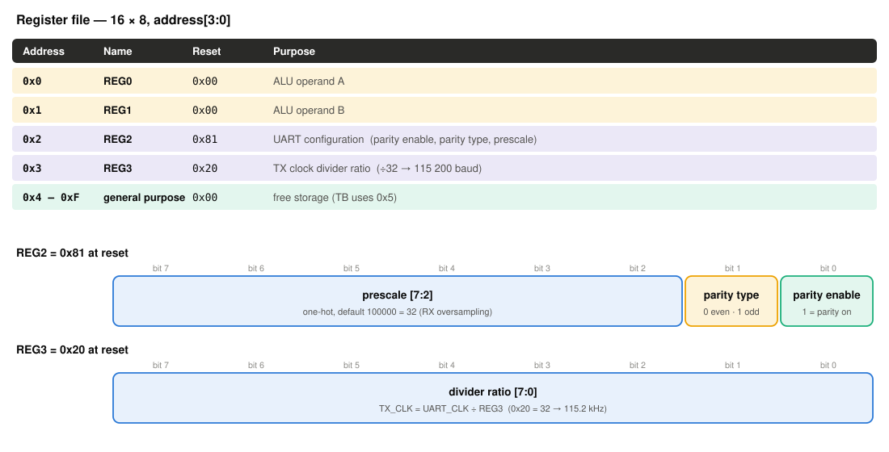
  <br><sub><b>Register map and bit fields of REG2 / REG3</b></sub>
</p>

### `REG2` – UART configuration

| Bits | Field | Default | Meaning |
|---|---|---|---|
| 0 | parity enable | 1 | 1 = parity bit present |
| 1 | parity type | 0 | 0 = even, 1 = odd |
| 7:2 | prescale | `100000` (32) | RX oversampling factor (one-hot) |

### `REG3` – TX divider

`0x20` (32) → baud clock = `UART_CLK / 32` = 115.2 kHz.

### Access rules

- A write with the read strobe also asserted is ignored.
- A read returns registered `RdData` together with `RdData_VLD` one cycle later.
- `REG0..REG3` are always visible as separate output ports (`REG0`, `REG1`, `REG2`, `REG3`).
- `REG2` and `REG3` are **quasi-static** – they are changed rarely, and feed the UART domain without synchronizers (declared quasi-static in the SpyGlass constraints).

---

## 7. Command protocol

Every transaction starts with an **opcode frame** followed by operand frames. All frames use the UART format in [section 8](#8-uart-frame-format). Responses are returned on `TX_OUT`.

| Opcode | Command | Frames after opcode | Response |
|---|---|---|---|
| `0xAA` | Register file write | `Address`, `Data` | none |
| `0xBB` | Register file read | `Address` | 1 byte (data) |
| `0xCC` | ALU operation **with** operands | `A`, `B`, `ALU_FUN` | 2 bytes: result LSB, then MSB |
| `0xDD` | ALU operation **without** operands | `ALU_FUN` | 2 bytes: result LSB, then MSB |

An unknown opcode is dropped and the controller returns to idle.

### Byte-sequence examples

```
Write 0x55 to address 0x05          RX: AA 05 55                    TX: (nothing)
Read address 0x05                   RX: BB 05                       TX: 55
Add 0x20 + 0x05                     RX: CC 20 05 00                 TX: 25 00
Subtract using stored REG0/REG1     RX: DD 01                       TX: 1B 00
Multiply 0x12 * 0x10                RX: CC 12 10 02                 TX: 20 01
```

<p align="center">
  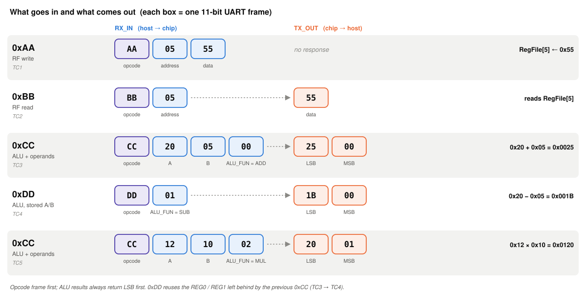
  <br><sub><b>The five test-bench transactions as UART frames</b></sub>
</p>

### Notes

- `0xCC` stages operand A into `REG0` and B into `REG1`, then runs the function.
- `0xDD` reuses whatever is currently in `REG0` / `REG1` (for example from a previous `0xCC`).
- The 16-bit ALU result is returned **LSB first**.
- To change UART settings, write `REG2` (address `0x02`) and `REG3` (address `0x03`) using the `0xAA` command, as the testbench does at start-up.

---

## 8. UART frame format

11 bits per frame (10 if parity is disabled). The figure shows the byte `0x55` with even parity and, below it, how the receiver samples inside one bit:

<p align="center">
  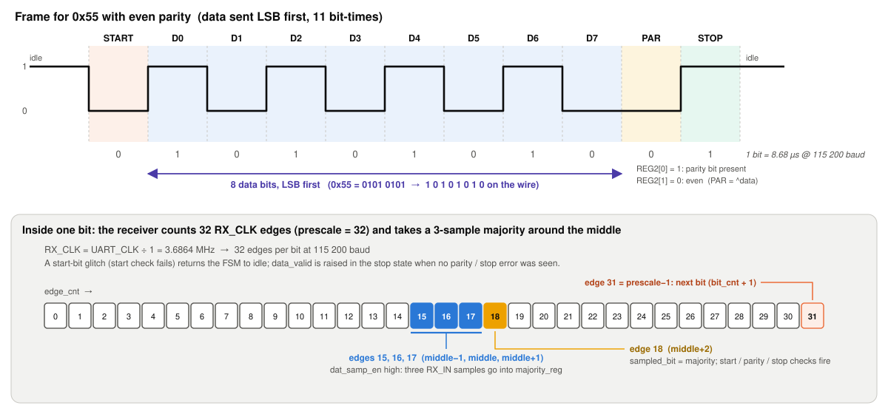
  <br><sub><b>UART frame and receiver sampling (prescale = 32)</b></sub>
</p>

- **Start bit**: 0.
- **Data**: 8 bits, LSB first.
- **Parity** (optional, `REG2[0]`): `REG2[1] = 0` → even parity (`^data`), `1` → odd parity.
- **Stop bit**: 1.

### Transmitter (`UART_TX`)

| Sub-block | Role |
|---|---|
| `UART_TX_FSM` | idle → start → data → parity → stop; `busy = state != idle` |
| `Serializer` | latches the parallel byte, 4-bit counter, raises `serDone` after the last data bit |
| `parity_Calc` | computes even/odd parity of the byte |
| `Mux_4X1` | selects the output bit: start (0), serial data, parity, or stop/idle (1) |

The transmitter starts when its input valid (`TX_IN_V = ~FIFO_EMPTY`) is asserted.

### Receiver (`UART_RX`)

| Sub-block | Role |
|---|---|
| `UART_RX_FSM` | idle / start / data / parity / stop / valid; drives `soft_rst` to the counter in idle and valid |
| `edge_bit_counter` | counts RX clock edges within a bit (`edge_cnt`) and bits within a frame (`bit_cnt`) |
| `data_sampling` | **3-sample majority vote** at `edge_cnt` = middle-1, middle, middle+1 |
| `deserializer` | shifts sampled bits into the parallel word |
| `strt_Check` | confirms the start bit is still low at sampling time; a glitch aborts back to idle |
| `parity_Check` | recomputes parity and compares |
| `stop_Check` | confirms the stop bit is 1 |

The sampled bit and the three checks fire at `edge_cnt == middle + 2`. `data_valid` is registered and raised from the stop state (bit count 10, or 9 without parity) at `edge_cnt == prescale - 1`, only when there is no parity or stop error.

---

## 9. Block-by-block description

### `SYS_TOP` / `SYS_TOP_dft`
Top-level integration of every block, clock/reset distribution, and the `CLKDIV_MUX` / `mux2X1` wiring. `SYS_TOP_dft` is the same design with scan ports and the scan-mode clock/reset multiplexers (`mux2X1`) so that all flops can be clocked and reset from `scan_clk` / `scan_rst` in test mode. `SYS_TOP_dft_pnr` is the same netlist structure with the port renames listed in [section 5](#5-top-level-interface).

### `SYS_CTRL`
Central FSM in the `REF_CLK` domain. Decodes opcodes, drives register-file and ALU control signals as one-cycle pulses and pushes response bytes into the FIFO. See [section 11](#11-sys_ctrl-state-machine).

### `RegFile`
16×8 storage with synchronous write, registered read, and `RdData_VLD`. `REG0..REG3` are brought out as dedicated ports.

### `ALU`
Combinational function decode feeding a **registered 16-bit output** and a registered `OUT_VALID`, both clocked by the gated clock. Operands are zero-extended: `A = {8'b0, REG0}`, `B = {8'b0, REG1}`. See [section 10](#10-alu-function-table).

### `CLK_GATE`
Latch + AND clock gate for the ALU. `CLK_EN` is driven by `SYS_CTRL` for the duration of an operation, so the ALU clock is silent when idle (dynamic-power saving).

### `ClkDiv`
Programmable integer clock divider (instantiated twice: RX and TX). See [section 4](#4-clocks-resets-and-baud-rate-math).

### `CLKDIV_MUX`
Translates the one-hot prescale from `REG2[7:2]` into the RX divider ratio.

### `DATA_SYNC`
Multi-bit enable-based synchronizer, UART→REF direction: the `data_valid` enable passes through a 2-flop synchronizer, an edge detector generates a one-cycle pulse, and that pulse captures the (stable) data bus into the destination domain.

### `ASYNC_FIFO`
Dual-clock FIFO, REF→TX direction:

| Parameter | Value |
|---|---|
| Depth | 8 entries |
| Data width | 8 bits |
| Address width | 3 bits |
| Pointer width | 4 bits (Gray code) |

- `FIFO_WR` – write pointer in binary and Gray; `wfull = (wptr == {~wq2_rptr[3:2], wq2_rptr[1:0]})`.
- `FIFO_RD` – read pointer in binary and Gray; `rempty = (rptr == rq2_wptr)`.
- `DF_SYNC` – 2-flop synchronizers for each Gray pointer.
- `FIFO_MEM_CNTRL` – dual-port memory, **no reset**, read combinationally.

<p align="center">
  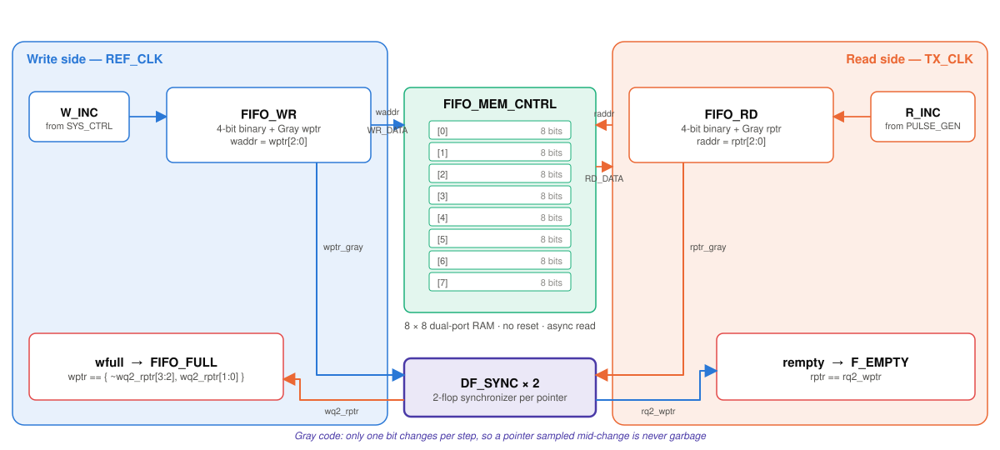
  <br><sub><b>ASYNC_FIFO: pointers, Gray conversion, 2-flop synchronizers and full / empty logic</b></sub>
</p>

### `PULSE_GEN`
In the TX_CLK domain. Converts the UART transmitter's `busy` level into a one-cycle `FIFO_R_INC` pulse so that exactly one FIFO entry is popped per transmitted frame.

### `RST_SYNC`
2-flop reset synchronizer (async assert, sync de-assert), one per domain.

### `mux2X1`
Simple 2:1 mux used in DFT mode to select between functional and scan clock/reset.

---

## 10. ALU function table

`ALU_FUN` is 4 bits. Output is 16 bits.

| `ALU_FUN` | Operation | Result |
|---|---|---|
| `0000` | Add | `A + B` |
| `0001` | Subtract | `A - B` |
| `0010` | Multiply | `A * B` |
| `0011` | Divide | `A / B` |
| `0100` | AND | `A & B` |
| `0101` | OR | `A \| B` |
| `0110` | NAND | `~(A & B)` |
| `0111` | NOR | `~(A \| B)` |
| `1000` | XOR | `A ^ B` |
| `1001` | XNOR | `~(A ^ B)` |
| `1010` | Equal | `A == B` → 1, else 0 |
| `1011` | Greater | `A > B` → 2, else 0 |
| `1100` | Less | `A < B` → 3, else 0 *(extra; not in the original spec)* |
| `1101` | Shift right | `A >> 1` |
| `1110` | Shift left | `A << 1` |
| others | – | 0 |

`OUT_VALID` is registered together with the result.

---

## 11. SYS_CTRL state machine

14 states in the `REF_CLK` domain.

| Code | State | Action |
|---|---|---|
| 0 | `S_IDLE` | wait for a valid RX word; latch opcode |
| 1 | `S_FRAME1` | capture first operand frame (address / A / ALU_FUN) |
| 2 | `S_FRAME2` | capture second frame (data / B) |
| 3 | `S_FRAME3` | capture third frame (ALU_FUN for `0xCC`) |
| 4 | `S_RF_WRITE` | pulse write enable with address and data |
| 5 | `S_RF_READ_REQ` | pulse read enable with address |
| 6 | `S_RF_READ_WAIT` | wait for `RdData_VLD` |
| 7 | `S_RF_READ_SEND` | push read data into the FIFO when `!FIFO_FULL` |
| 8 | `S_ALU_WR_A` | write operand A into `REG0` |
| 9 | `S_ALU_WR_B` | write operand B into `REG1` |
| 10 | `S_ALU_EXEC` | assert ALU `EN` and `CLK_EN` with `ALU_FUN` |
| 11 | `S_ALU_WAIT` | wait for `OUT_Valid`, then drop `CLK_EN` |
| 12 | `S_ALU_SEND_LSB` | push result[7:0] into the FIFO when `!FIFO_FULL` |
| 13 | `S_ALU_SEND_MSB` | push result[15:8] into the FIFO when `!FIFO_FULL` |

<p align="center">
  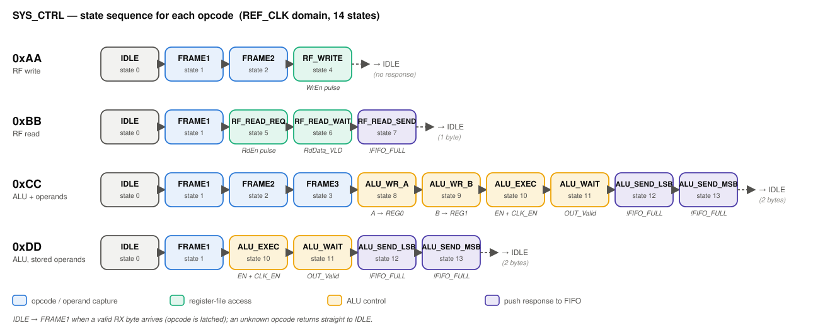
  <br><sub><b>SYS_CTRL: state sequence per opcode</b></sub>
</p>

Path summary in text form:

```
0xAA : IDLE → FRAME1 → FRAME2 → RF_WRITE → IDLE
0xBB : IDLE → FRAME1 → RF_READ_REQ → RF_READ_WAIT → RF_READ_SEND → IDLE
0xCC : IDLE → FRAME1 → FRAME2 → FRAME3 → ALU_WR_A → ALU_WR_B → ALU_EXEC → ALU_WAIT → SEND_LSB → SEND_MSB → IDLE
0xDD : IDLE → FRAME1 → ALU_EXEC → ALU_WAIT → SEND_LSB → SEND_MSB → IDLE
```

---

## 12. Clock-domain-crossing strategy

| Crossing | Direction | Technique |
|---|---|---|
| RX data word | UART → REF | `DATA_SYNC`: 2-flop synchronized enable + edge-detect pulse to capture the stable data bus |
| TX response bytes | REF → UART (TX) | `ASYNC_FIFO` with Gray-coded pointers and 2-flop `DF_SYNC` |
| FIFO pop control | TX domain | `PULSE_GEN` makes a one-cycle pop from the busy level |
| Resets | external → each domain | `RST_SYNC`: async assert, sync de-assert |
| `REG2`, `REG3` | REF → UART | quasi-static configuration – no synchronizer, declared quasi-static for CDC analysis |

<p align="center">
  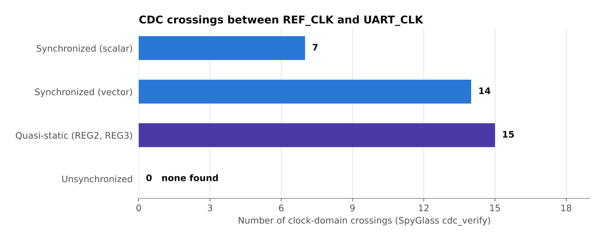
  <br><sub><b>SpyGlass cdc_verify: no unsynchronized crossings</b></sub>
</p>

Design rules followed:

- Only one bit changes per Gray-pointer increment, so a sampled pointer is always valid or off by one.
- Full and empty are conservative (a stale synchronized pointer can only make the FIFO look fuller/emptier, never overflow/underflow).
- Multi-bit buses cross only while the associated enable is stable and synchronized.
- The configuration registers are only meaningful when written before traffic starts; changing them during a transfer is not safe.

---

## 13. Verification

### Testbench (`TB/SYS_TB.sv`, module `SYS_TOP_tb`)

Self-checking, drives `RX_IN` with real UART frames and decodes `TX_OUT` to a scoreboard.

| Parameter | Value |
|---|---|
| `REF_CLK_PERIOD` | 20.000 ns |
| `UART_CLK_PERIOD` | 271.267 ns |
| `BIT_PERIOD` | 8680.55 ns |

Sequence:

1. Reset low from 100 ns to 300 ns, then wait 1 µs.
2. Configure UART over the link: write `0x81` to `REG2` and `0x20` to `REG3`.
3. Run the test cases below.

`send_uart_frame` emits a start bit, eight data bits LSB first, even parity (`^data`) and a stop bit. The monitor waits for a falling edge on `TX_OUT` (200-bit-period timeout), samples in the middle of each bit, and reads the remaining parity/stop slots. For commands expecting no response, it waits 50 bit periods and checks that nothing was transmitted.

### Test cases

| TC | Description | Frames sent | Expected `TX_OUT` |
|---|---|---|---|
| 1 | RegFile write `0x55` to address `0x05` | `AA 05 55` | none (`RF[5] = 0x55`) |
| 2 | RegFile read address `0x05` | `BB 05` | `55` |
| 3 | ALU ADD `0x20 + 0x05` | `CC 20 05 00` | `25 00` |
| 4 | ALU SUB using stored operands (`0x20 - 0x05`) | `DD 01` | `1B 00` |
| 5 | ALU MUL `0x12 * 0x10` | `CC 12 10 02` | `20 01` |

### Result

```
Total: 5 | Passed: 5 | Failed: 0
ALL TESTS PASSED!
```

The transcript printed by the testbench:

<p align="center">
  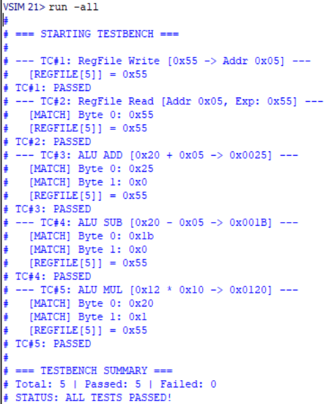
  <br><sub><b>ModelSim transcript: Total 5, Passed 5, Failed 0</b></sub>
</p>

Where each test case sits on the simulation time axis (start times are the testbench's `tc_start_time` values):

<p align="center">
  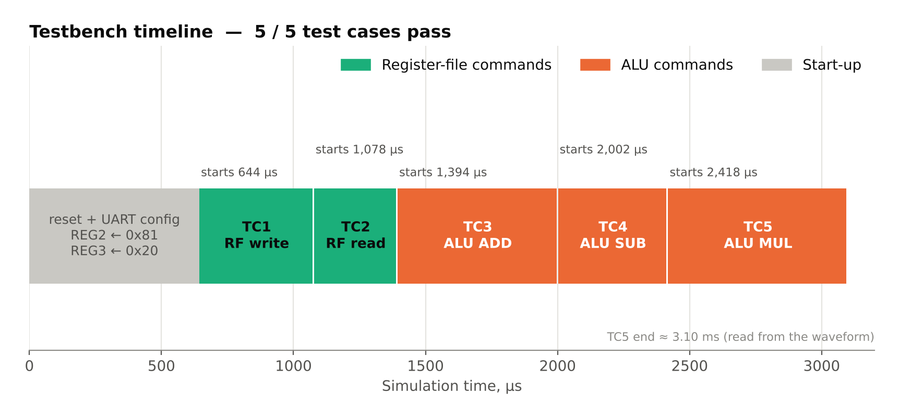
  <br><sub><b>Testbench timeline</b></sub>
</p>

### Waveforms

ModelSim waveforms for every test case. Each image shows the testbench variables (`test_case_id`, `test_label`, `tc_start_time`, expected bytes), the `SYS_CTRL` state, the UART RX bus `P_DATA` with `data_valid`, the FIFO signals, UART TX `txOut` / `busy` and the register file contents. Click an image for the original vector (SVG) export.

**TC1 — RegFile write `0x55` to address `0x05`.** The last three `data_valid` pulses deliver `AA`, `05`, `55` (the first pulse in the window is the end of the start-up configuration); `SYS_CTRL` steps through its frame states, and `regArr[5]` changes from `00000000` to `01010101`. `txOut` stays idle because a write has no response.

<p align="center">
  <a href="docs/images/waveforms/tc1_rf_write.svg">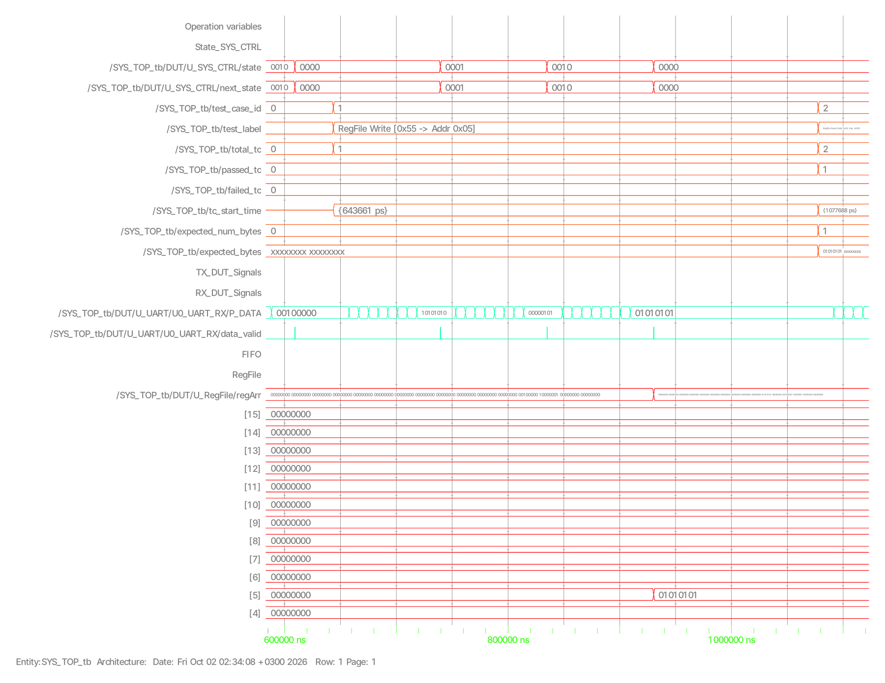</a>
</p>

**TC2 — RegFile read of address `0x05`, expecting `0x55`.** After the two command frames the controller reads the register and pushes one byte into the FIFO; the `EMPTY` flag drops and `txOut` transmits the byte.

<p align="center">
  <a href="docs/images/waveforms/tc2_rf_read.svg">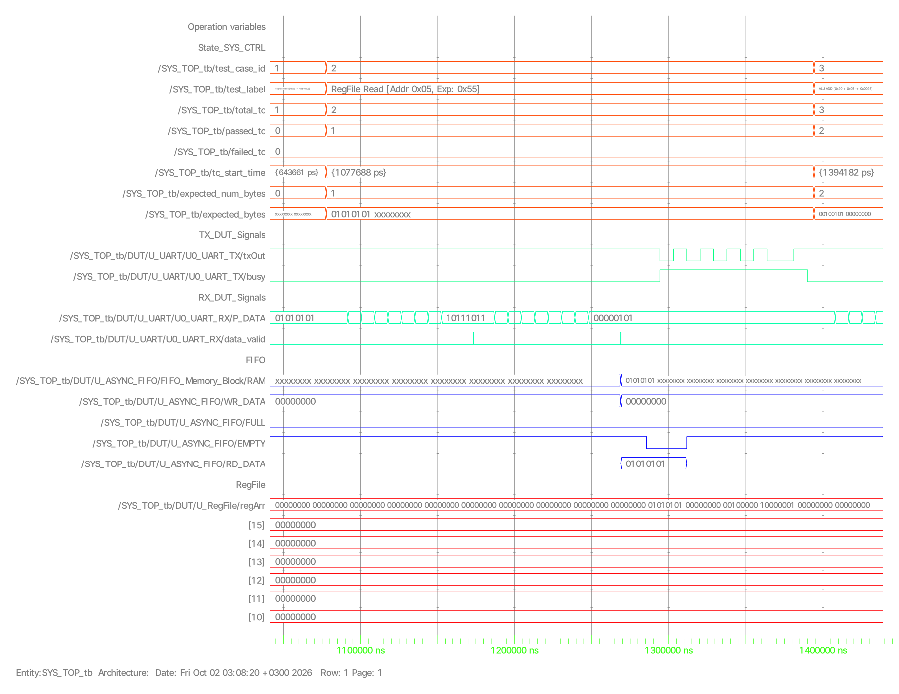</a>
</p>

**TC3 — ALU ADD `0x20 + 0x05`.** `P_DATA` shows `CC` (`11001100`), `20` (`00100000`), `05` and `00`; the FIFO read data shows `25` (`00100101`) followed by `00`, and `txOut` shifts out those two frames while `busy` is high.

<p align="center">
  <a href="docs/images/waveforms/tc3_alu_add.svg">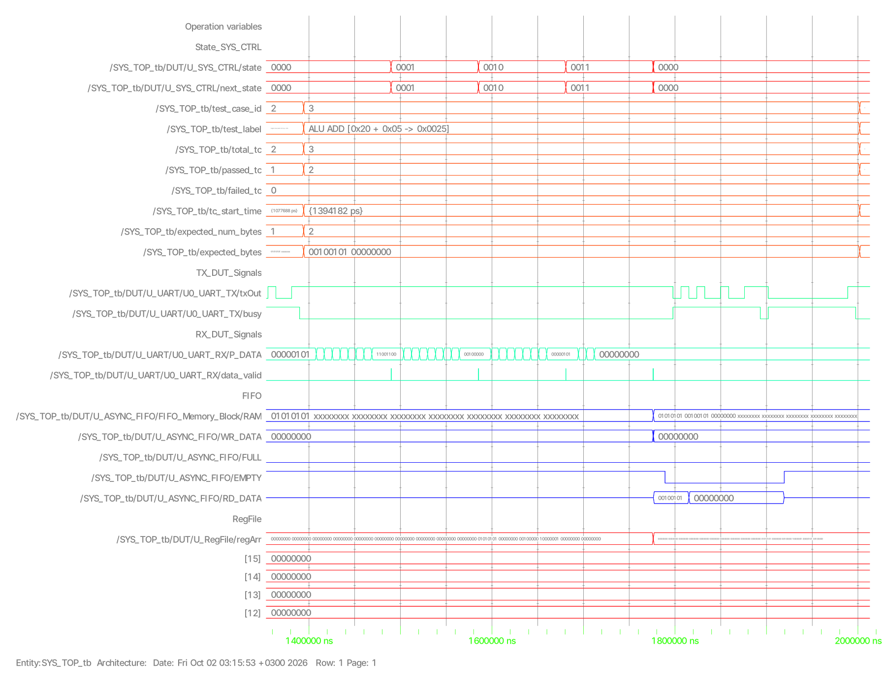</a>
</p>

**TC4 — ALU SUB with the operands left in `REG0` / `REG1` by TC3.** Only the two frames `DD`, `01` are sent; the response is `1B` then `00`.

<p align="center">
  <a href="docs/images/waveforms/tc4_alu_sub.svg">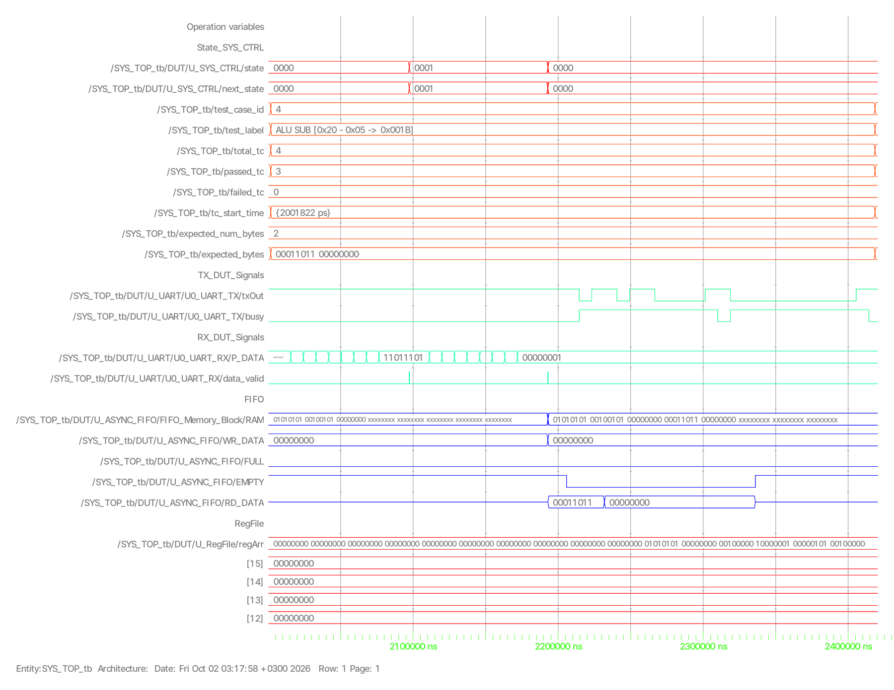</a>
</p>

**TC5 — ALU MUL `0x12 * 0x10`.** `CC 12 10 02` in; `RD_DATA` shows `00100000` (`0x20`) then `00000001` (`0x01`), i.e. `0x0120`, transmitted LSB first.

<p align="center">
  <a href="docs/images/waveforms/tc5_alu_mul.svg">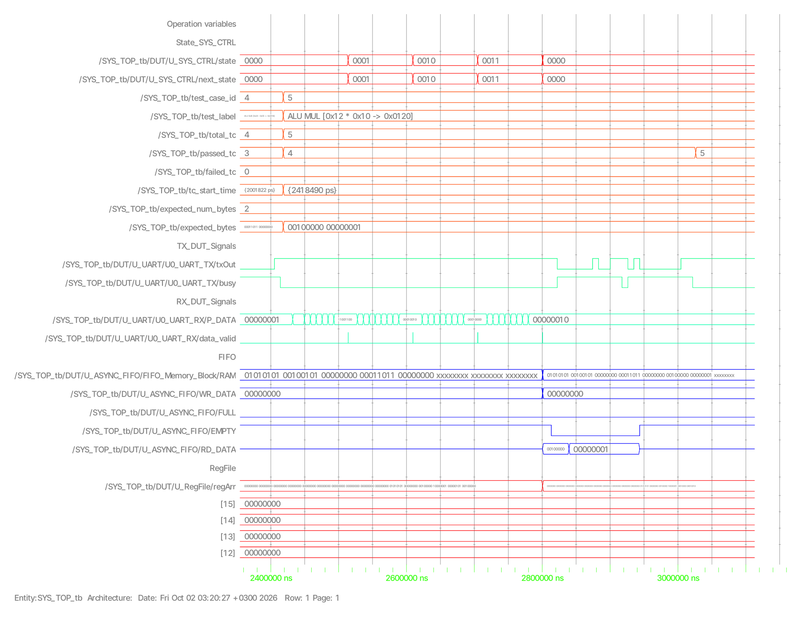</a>
</p>

The original ModelSim exports (both pages per test case) are kept in `Results/`; the waveforms also confirm `regArr[2] = 10000001` and `regArr[3] = 00100000` after the start-up configuration.

---

## 14. Backend flow and results

Synthesis, DFT and Formality scripts live in `Backend/`; the final DFT run and the place-and-route project live in `System_pnr/`, with the exported layout results in `PnR/`. SpyGlass runs on the RTL; synthesis and scan insertion each have their own equivalence check against the RTL, and the routed netlist's check is still a template.

<p align="center">
  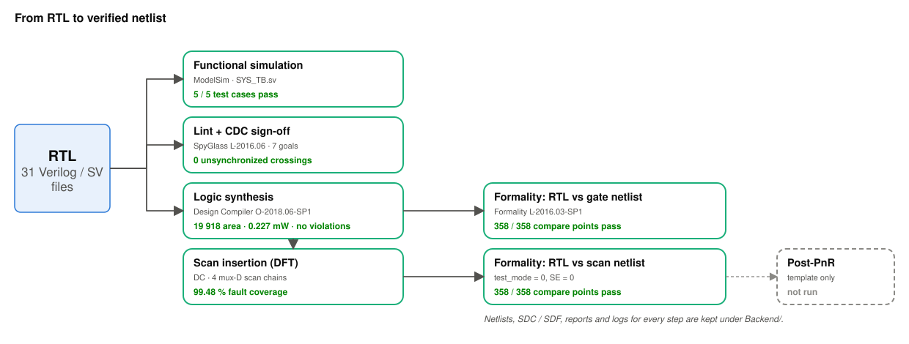
  <br><sub><b>Design and verification flow</b></sub>
</p>

### 14.1 Synthesis (`Backend/Synthesis`)

Tool: Synopsys Design Compiler O-2018.06-SP1, flow `run_syn.sh` → `dc_shell -f syn_script.tcl`. Steps: analyze/elaborate, link, check_design, apply constraints, `compile_ultra`, write netlist/SDF/SDC, write reports.

**Constraints (`cons.tcl`)**

| Item | Setting |
|---|---|
| `REF_CLK` | 20 ns |
| `UART_CLK` | 271.296799 ns |
| Generated clocks | `ALU_CLK` (÷1 on `U_CLK_GATE/GATED_CLK`), `RX_CLK` (÷1 on `U_ClkDiv_RX/o_div_clk`), `TX_CLK` (÷32 on `U_ClkDiv_TX/o_div_clk`) |
| Uncertainty | 0.2 ns setup, 0.1 ns hold |
| Transition | 0.05 ns |
| Clock groups | asynchronous: {REF_CLK, ALU_CLK} vs {UART_CLK, RX_CLK, TX_CLK} |
| Input delay | 0.2 × UART period on `RX_IN` (relative to `RX_CLK`) |
| Output delay | 0.2 × UART period × 32 on `TX_OUT` (relative to `TX_CLK`); 0.2 × UART period on `RF_PAR_ERR` / `RF_STP_ERR` |
| Driving cell / load | `BUFX2M` / 0.1 |
| Operating conditions | min = ff, max = ss |

**Synthesized top-level symbol** (Design Compiler):

<p align="center">
  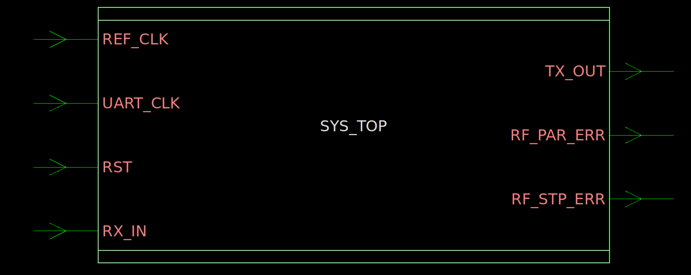
  <br><sub><b>SYS_TOP after synthesis: 4 inputs, 3 outputs</b></sub>
</p>

**Results**

| Metric | Value |
|---|---|
| Total cells | 1,945 (1,585 combinational, 357 sequential, 259 buffers/inverters) |
| Total area | 19,918.00 (combinational 10,970.37, non-combinational 8,947.63, buf/inv 921.36) |
| Kept hierarchy | `ClkDiv_RX` 488.33, `ClkDiv_TX` 643.65, `CLK_GATE` 40.01 |
| Total power | 0.227 mW (switching 4.47e-03 mW, internal 0.213 mW, leakage 9.36 µW) |
| Constraint violations | none |

| Clock | Worst setup slack (ns) |
|---|---|
| `ALU_CLK` | 10.06 |
| `REF_CLK` | 14.92 |
| `RX_CLK` | 215.83 |
| `TX_CLK` | 6942.42 |
| `UART_CLK` | 268.08 |

<p align="center">
  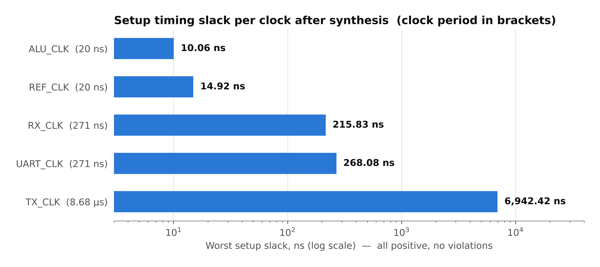
  <br><sub><b>Worst setup slack per clock after synthesis</b></sub>
</p>

Hold slack across the design: 0.34 – 0.73 ns, all met. The log contains 47 benign LINT warnings (LINT-1, 31, 32, 33, 52).

### 14.2 DFT scan insertion (`Backend/DFT`, `System_pnr/DFT`)

Style: multiplexed-flip-flop scan, no clock mixing. The script runs `set_scan_configuration -clock_mixing no_mix -style multiplexed_flip_flop -replace true -max_length 100` (the chain count is no longer forced), then `compile_ultra -scan`, `dft_drc` and `insert_dft`. With the 100-cell limit Design Compiler builds **four** chains, and the top module now declares `NUM_OF_CHAINS = 4` so that the scan ports match (an earlier run declared three scan ports while four chains were built, which produced an extra `test_si4` port; that was fixed in commit `c9dd32c`).

**DFT signals**

| Signal | Role |
|---|---|
| `scan_clk` | ScanClock, 20 ns, timing {20 40} |
| `scan_rst` | Reset, active-low |
| `test_mode` | Constant / TestMode, active-high |
| `SE` | ScanEnable, active-high |
| `SI[3:0]` | ScanDataIn, one per chain |
| `SO[3:0]` | ScanDataOut, one per chain |

**Scan chains (`Backend/DFT/log/dft.log`)**

| Chain | In → Out | Cells | First cell |
|---|---|---|---|
| 1 | `SI[3]` → `SO[3]` | 91 | `RST_SYNC_1/Synchronizer_reg[0]` |
| 2 | `SI[2]` → `SO[2]` | 90 | `U_ASYNC_FIFO/FIFO_Memory_Block/RAM_reg[6][1]` |
| 3 | `SI[1]` → `SO[1]` | 90 | `U_RegFile/regArr_reg[3][1]` |
| 4 | `SI[0]` → `SO[0]` | 90 | `U_RegFile/regArr_reg[14][3]` |

**Coverage and cell stats**

| Metric | Value |
|---|---|
| Sequential cells in the netlist | 362 (350 scan flops, 11 plain flops, 1 clock-gate latch); the DC area report counts 364 |
| Cells in chains | 361 |
| DRC violations before insertion | 2 – `TEST-126` (clock-gate latch not scannable) and `TEST-505` (latch constant 1) |
| DRC violations after insertion | 1 – `TEST-505` (expected) |
| Faults (uncollapsed) | 16,140 |
| Detected | 16,014 |
| ATPG-untestable | 87 |
| Undetectable | 37 |
| Not detected | 2 |
| **Test coverage** | **99.45 %** |

The same flow was repeated in `System_pnr/DFT` on `SYS_TOP_dft_pnr.v` to produce the netlist that goes into place and route: 4 chains of 91/90/90/90 cells, 16,124 faults, **99.48 %** coverage, area 22,024.29, 1,834 cells (364 sequential). That run also writes the SDC files for the three analysis modes (`SYS_TOP_func.sdc`, `SYS_TOP_scan.sdc`, `SYS_TOP_capture.sdc`), the SDF and the SVF.

<p align="center">
  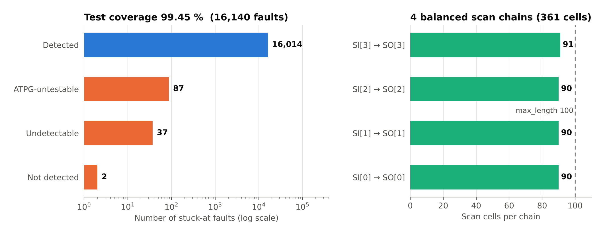
  <br><sub><b>ATPG fault statistics and scan-chain balance</b></sub>
</p>

**Post-DFT quality of results (`Backend/DFT`)**

| Metric | Post-synthesis | Post-DFT | Change |
|---|---|---|---|
| Area | 19,918.00 | 22,024.29 | +10.57 % |
| Cells | 1,945 | 1,845 | −100 |
| Power | 0.227 mW | 0.385 mW | about +70 % |
| Worst setup | – | 13.01 ns (`SE` → `RAM_reg[0][3]` on `SCAN_CLK`); ALU path 18.87 ns | all met |
| Hold | – | 0.32 / 0.46 ns | all met |

<p align="center">
  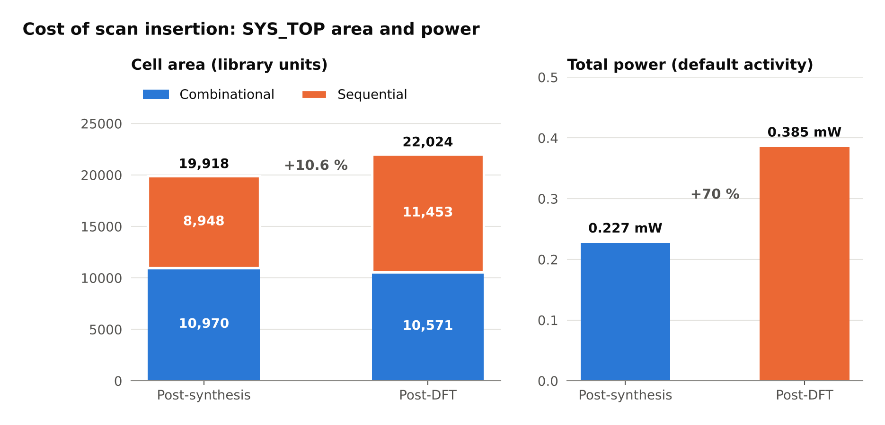
  <br><sub><b>Area and power: post-synthesis vs post-DFT</b></sub>
</p>

Post-DFT cell mix: 279 `SDFFRQX1M`, 64 `SDFFQX1M`, 10 `DFFRQX1M`, 4 `SDFFRQX2M`, 2 `SDFFSQX2M`, 1 `SDFFSQX1M`, 1 `DFFRQX2M` and 1 `TLATNX1M` (the clock-gate latch; the synthesis netlist instead uses the integrated `TLATNCAX12M` cell).

<p align="center">
  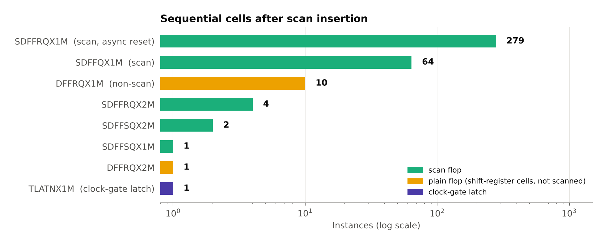
  <br><sub><b>Sequential cells after scan insertion</b></sub>
</p>

### 14.3 Formal equivalence (`Backend/Formality`)

Tool: Synopsys Formality L-2016.03-SP1.

| Comparison | Passing points | Failing | Aborted | Unverified |
|---|---|---|---|---|
| RTL vs post-synthesis | 358 (3 ports, 354 DFF, 1 latch `U_CLK_GATE/U0_TLATNCAX12M`) | 0 | 0 | 0 |
| RTL vs post-DFT | 365 (3 ports, 361 DFF, 1 latch) | 0 | 0 | 0 |

Run time of about 137 s for the post-synthesis comparison. Post-DFT notes:

- `test_mode = 0` and `SE = 0` are applied as constants during the compare.
- The scan ports are excluded with `set_dont_verify_points` using the patterns `SI[*]` and `SO[*]` (all eight scan ports, reference and implementation).
- 0 unmatched compare points; 6 unmatched *unread* points on the reference side.
- `FMR_ELAB-147` warning: `Serializer` indexes `pDataReg[counter]` with a 4-bit counter into an 8-entry vector (see [section 16](#16-known-limitations-and-notes)).

`Backend/Formality/post-PnR` still contains only the script template: the reader and compare sections are blank, so the routed netlist has not been formally compared against the RTL.

### 14.4 SpyGlass lint and CDC (`Results/Spyglass_Results`)

Tool: SpyGlass L-2016.06. Seven goals were run; consolidated reports are in `Results/Spyglass_Results/consolidated_reports/`.

| Goal | Result |
|---|---|
| `Design_Read` | 7 info, 0 errors |
| `lint_lint_rtl` | 1 error: `InferLatch` at `CLK_GATE.v` line 24 – the intended clock-gate latch; no combinational loops |
| `cdc_cdc_setup_check` | 1 `Setup_port01` waived, 14 info |
| `cdc_clock_reset_integrity` | 2 `Clock_glitch04` waived, 11 info |
| `cdc_cdc_abstract` | 1 waived, 12 info |
| `cdc_cdc_verify_struct` | 3 waived, 40 reported |
| `cdc_cdc_verify` | 6 waivers applied (`Setup_port01`, `Ac_clockperiod03`, `Ac_cdc01a`, `Ac_conv01`, `Ac_datahold01a` ×2), 45 reported |

The crossing classification is plotted in [section 12](#12-clock-domain-crossing-strategy).

**CDC verification metrics**

| Metric | Value |
|---|---|
| Clocks / resets | 2 / 1 |
| Registers / flat instances | 367 / 1,290 |
| Synchronized crossings | 7 scalar + 14 vector |
| **Unsynchronized crossings** | **0** |
| Quasi-static crossings | 15 (`REG2[0:7]`, `REG3[0:7]`) |
| Reset synchronizers | 2, synchronous de-assertion |
| Reset initialization | 82.56 % (64 unknown flops – consistent with the un-reset 8×8 FIFO memory) |

Rules involved include `Ac_sync01/02`, `Ac_unsync01/02`, `Ac_conv01`, `Ac_cdc01a`, `Ac_datahold01a`, `Setup_port01`, `Clock_glitch04`, `InferLatch`, `Ar_sync01`, `Ar_syncdeassert01`.

### 14.5 Place and route (`System_pnr/pnr`, `PnR/`)

Tool: Cadence First Encounter 08.10-p004_1. The input is the scan-inserted netlist from `System_pnr/DFT` and its SDC, with the TSMC 0.13 µm library (`scmetro_tsmc_cl013g_rvt`, 7-metal tech LEF). The flow is split into one Tcl script per step:

<p align="center">
  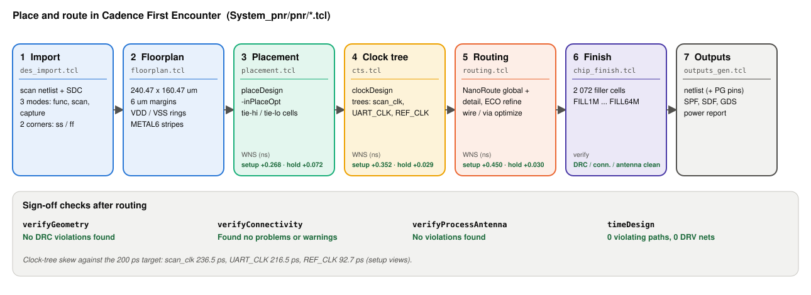
  <br><sub><b>Place-and-route steps and results</b></sub>
</p>

**Setup**

| Item | Value |
|---|---|
| Analysis modes | `func_mode` (`test_mode = 0`, `SE = 0`), `scan_mode` (`test_mode = 1`, `SE = 1`), `capture_mode` (`test_mode = 1`, `SE = 0`) |
| Corners | max = ss 1.08 V 125 °C, min = ff 1.32 V −40 °C; one RC corner (`tsmc13fsg.capTbl`) |
| Analysis views | setup and hold for each of the three modes (6 views) |
| Die size | 240.47 × 160.47 µm with 6 µm margins on every side |
| Power grid | `VDD` / `VSS` rings and `METAL6` stripes (1 µm wide, 60 µm set-to-set) |
| Placement | `placeDesign -inPlaceOpt -prePlaceOpt`, tie-hi / tie-lo cells added |
| Clock tree | `clockDesign` with one tree each for `scan_clk` (root pin), `UART_CLK` and `REF_CLK` |
| Routing | NanoRoute, global + detail with via / wire optimization and an ECO refine pass (`refinePlace -preserveRouting`) |
| Finish | 2,072 filler cells (`FILL1M` … `FILL64M`) |
| Exports | netlist (with and without PG pins), SPF, SDF, GDS (≈ 199 KB), power report |

**Timing (all views, `timeDesign` summaries in `PnR/timingReports/`)**

| Stage | Setup WNS | Hold WNS | Violating paths | Placement density |
|---|---|---|---|---|
| Pre-CTS | +0.268 ns | +0.072 ns | 0 | 66.7 % |
| Post-CTS | +0.352 ns | +0.029 ns | 0 | 72.6 % |
| Post-route | +0.450 ns | +0.030 ns | 0 | 100 % (filler cells included) |

After routing, setup WNS by path group is: reg2reg +0.450 ns, in2reg +15.559 ns, reg2out +13.147 ns, clock-gating +17.083 ns. There are no max-cap, max-transition or max-fanout violations.

<p align="center">
  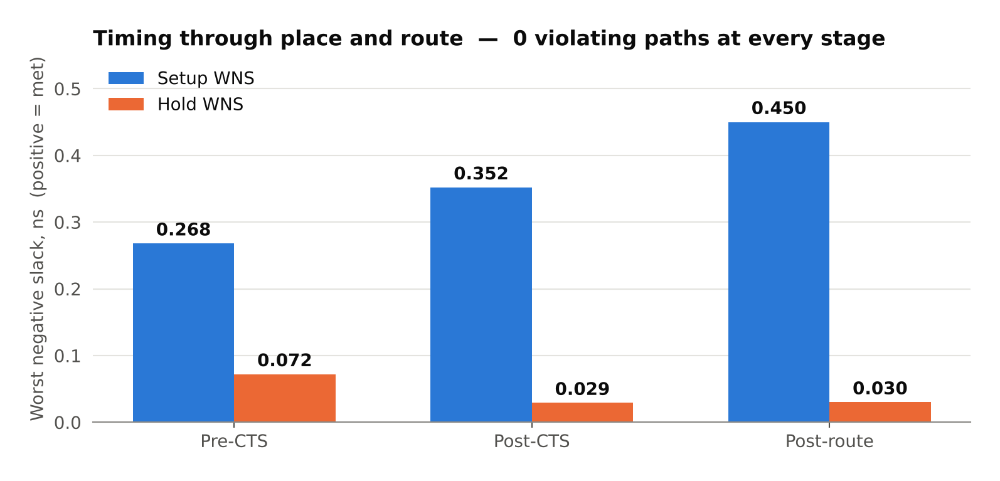
  <br><sub><b>Worst slack at each place-and-route stage</b></sub>
</p>

**Clock trees (`System_pnr/pnr/clock_report/clock.report`)**

| Tree | Buffers | Levels | Skew (setup views) | Skew (hold views) | Target |
|---|---|---|---|---|---|
| `scan_clk` | 86 | 19 | 236.5 ps | 96.8 ps | 200 ps |
| `UART_CLK` | 30 | 15 | 216.5 ps | – | 200 ps |
| `REF_CLK` | 42 | 11 | 92.7 ps | – | 200 ps |

**Sign-off checks**

| Check | Result |
|---|---|
| `verifyGeometry -noMinArea` | No DRC violations found |
| `verifyConnectivity -type all` | Found no problems or warnings |
| `verifyProcessAntenna` | No violations found |

**Power** (`report_power`, ss corner, 0.2 activity on primary inputs, no activity file): 0.939 mW total, made of 0.628 mW internal, 0.296 mW switching and 0.016 mW leakage. Sequential cells account for 45.4 % and combinational cells for 54.6 %. This is a different tool and activity assumption from the Design Compiler numbers above, so the two totals should not be compared directly.

<p align="center">
  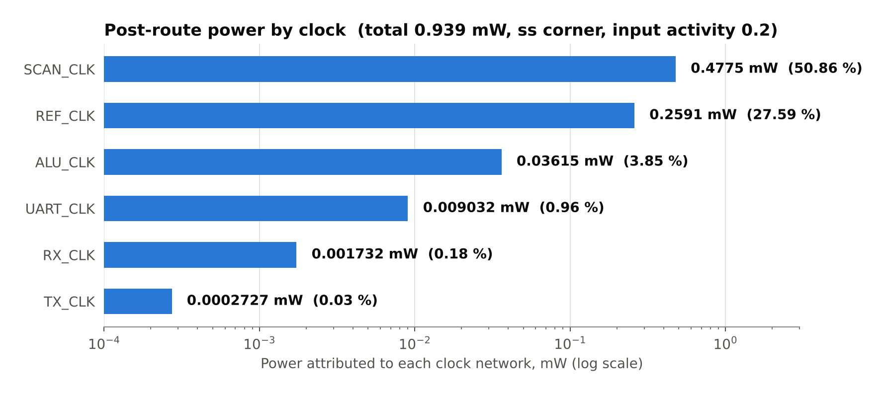
  <br><sub><b>Post-route power attributed to each clock</b></sub>
</p>

**Layout**

<p align="center">
  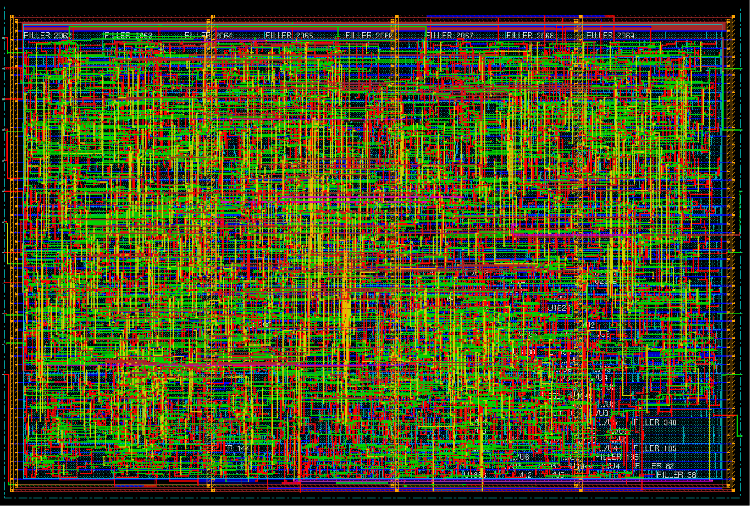
  <br><sub><b>Routed layout of SYS_TOP (Results/Layout/Layout.png)</b></sub>
</p>

<p align="center">
  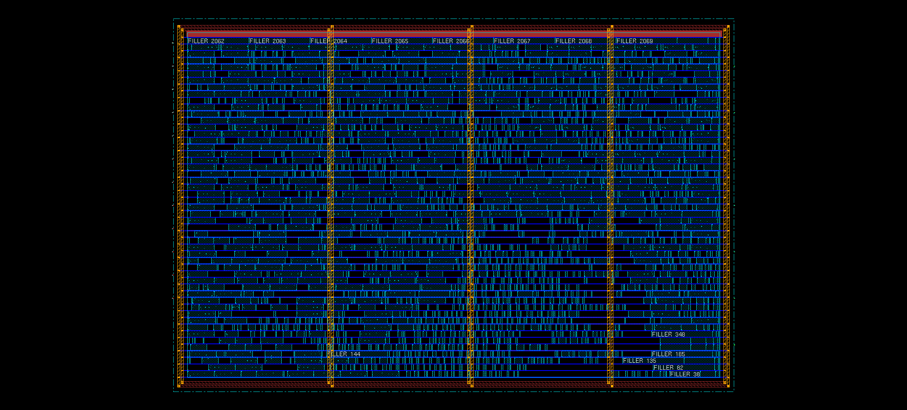
  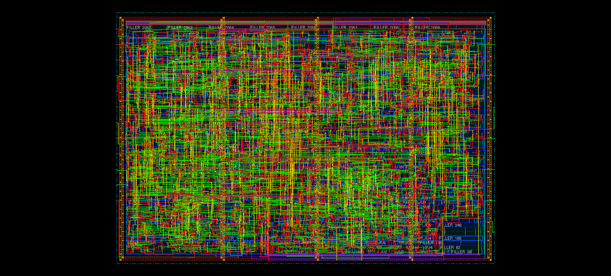
  <br><sub><b>Encounter screenshots: floorplan view with power stripes and placed cell rows (left), routed view (right)</b></sub>
</p>

<p align="center">
  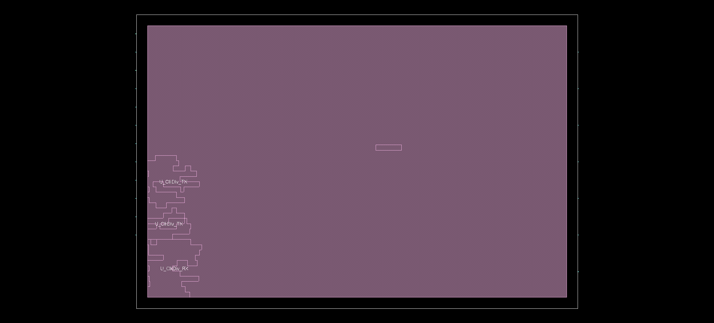
  <br><sub><b>Amoeba (module-placement) view, where the clock-divider modules `U_ClkDiv_TX` and `U_ClkDiv_RX` are labelled</b></sub>
</p>

---

## 15. How to run

The repository ships scripts rather than a Makefile, and the scripts use absolute paths from the original author's machine (for example `/home/ICer/IC/Projects/System/...` and `/home/IC/tsmc_fb_cl013g_sc/...`). Edit these to match your environment and technology library installation before running.

### Simulation (ModelSim / QuestaSim)

The repository does not include a `.do` file. A typical flow is:

```bash
vlib work
vlog RTL/ALU/ALU.v \
     RTL/ASYNC_FIFO/*.v \
     RTL/CLKDIV_MUX/*.v RTL/CLK_Divider/*.v RTL/Clock_Gating/*.v \
     RTL/DATA_SYNC/*.v RTL/PULSE_GEN/*.v RTL/RST_SYNC/*.v \
     RTL/RegFile/*.v RTL/SYS_CTRL/*.v RTL/mux2X1/*.v \
     RTL/UART/UART_RX/*.v RTL/UART/UART_RX/*.sv \
     RTL/UART/UART_TX/*.v RTL/UART/UART_TX/*.sv \
     RTL/UART/UART_TOP/*.v \
     RTL/SYS_TOP/SYS_TOP.v \
     TB/SYS_TB.sv
vsim -c work.SYS_TOP_tb -do "run -all; quit"
```

Use `SYS_TOP.v` for functional simulation (`SYS_TOP_dft.v` is the scan-ready version and should replace it for DFT work, not be compiled together).

### Synthesis

```bash
cd Backend/Synthesis
./run_syn.sh          # dc_shell -f syn_script.tcl | tee log/syn.log
```

Outputs go to `netlists/` and `reports/`. File list is in `system.lst`.

### DFT

```bash
cd Backend/DFT
./run_dft.sh
```

The same script exists in `System_pnr/DFT/` for the run on `SYS_TOP_dft_pnr.v` that feeds place and route.

### Formality

```bash
cd Backend/Formality/post-syn
tclsh run_syn_fm.tcl         # or run the fm_shell command it wraps
cd ../post-dft
tclsh run_dft_fm.tcl
```

The `run_*` files create `logs/` and `reports/` and invoke `fm_shell -f <script>`.

### SpyGlass

SpyGlass project files are not stored in the repo (the `spyglass/` working directory is git-ignored); only the consolidated reports are provided in `Results/Spyglass_Results/`.

### Place and route

The Encounter project is in `System_pnr/pnr/` and the scripts are meant to be sourced in this order (taken from the file names and the saved `encounter.cmd*` history; the repo has no single driver script):

```tcl
source des_import.tcl      ;# netlist, LEFs, libraries, MMMC views
source floorplan.tcl
# power rings / stripes were added interactively (see encounter.cmd*)
source placement.tcl
source cts.tcl
source routing.tcl
source chip_finish.tcl
source outputs_gen.tcl
```

`des_import.tcl` points at `/home/ahesham/Projects/System_pnr/...`; change those paths (and the `NUM_SCAN_CHAINS` variable, which selects the LEF and floorplan size) before running. The exported results are mirrored in `PnR/`.

---

## 16. Known limitations and notes

- **ALU output width**: the specification's ALU table lists an 8-bit `ALU_OUT` by default, while `SYS_CTRL` and the RTL use 16 bits (needed for multiplication). The RTL is the reference.
- **Extra ALU function**: `1100` (`A < B` → 3) is implemented but not listed in the specification.
- **Register address range**: the specification describes normal access in `0x4`–`0x15`, but addresses are 4 bits, so the file has locations `0x0`–`0xF`.
- **Quasi-static configuration**: `REG2` and `REG3` cross into the UART domain without synchronizers. Change them only when the link is idle.
- **Un-reset FIFO memory**: the FIFO RAM has no reset; reads of never-written entries are unknown in simulation (SpyGlass reports 64 unknown flops).
- **Serializer index width**: `pDataReg[counter]` uses a 4-bit counter against an 8-bit vector (Formality `FMR_ELAB-147`). The counter never exceeds 7 while transmitting data, so it is benign in practice, but it may be tightened to 3 bits.
- **Testbench parity**: the TB monitor skips over the parity bit rather than checking it.
- **Synthesis `.ddc`**: `Backend/Synthesis/netlists/SYS_TOP.ddc` is plain Verilog text, because `syn_script.tcl` writes both files with `-format verilog`. The DFT script writes a real binary `.ddc`.
- **Post-PnR Formality** is still an empty template, so the routed netlist has not been compared against the RTL.
- **Clock-tree skew**: the `scan_clk` (236.5 ps) and `UART_CLK` (216.5 ps) trees exceed the 200 ps skew target in the CTS report, although post-route timing is met.
- **Two DFT runs**: `Backend/DFT` (on `SYS_TOP_dft.v`) reports 99.45 % coverage and `System_pnr/DFT` (on `SYS_TOP_dft_pnr.v`) reports 99.48 %; the netlist used for place and route is the second one.
- **Sequential cell count**: the DFT netlist contains 362 sequential instances while the DC area report says 364.
- **Clock-gate cell**: the synthesis netlist uses the integrated `TLATNCAX12M` cell, while the DFT netlist uses a plain `TLATNX1M` latch, which is the cell DFT flags as not scannable (`TEST-126`).
- **Hard-coded paths**: `System_pnr/pnr/des_import.tcl` and `MMMC.tcl` use `/home/ahesham/...` and relative `../std_cells` paths.
- **Working files in the repo**: `System_pnr/DFT/work/`, `alib-52/`, `*.sdc~` backups and several `encounter.log*` / `.enc` snapshots are committed alongside the final results.
- **Second generator script**: `docs/scripts/make_diagrams.py` (Graphviz-based) writes some of the same file names as `docs/tools/` (for example `uart_frame.svg` and `register_map.svg`); running both will overwrite one set with the other.
- **Duplicated logs**: `dft_fm_log.log` appears in two places under `Backend/Formality/post-dft`.
- **SpyGlass `Setup_port01`** flags one of four data ports; the reports do not name it, but it is most likely `RX_IN` (an abstract port without constraint values).
- The `PULSE_GEN` header comment calls it a "bit synchronizer"; functionally it is an edge/level-to-pulse generator.
- The clock-gate latch is intentionally inferred (`InferLatch` lint error, DFT `TEST-505`), and both are expected.

---

## 17. Tools

| Stage | Tool / version |
|---|---|
| Simulation | ModelSim |
| Synthesis & DFT | Synopsys Design Compiler O-2018.06-SP1 |
| Formal equivalence | Synopsys Formality L-2016.03-SP1 |
| Place and route | Cadence First Encounter 08.10-p004_1 |
| Lint & CDC | Synopsys SpyGlass L-2016.06 |
| Technology | TSMC 0.13 µm standard-cell library (`scmetro_tsmc_cl013g_rvt`, ss/tt/ff corners), 7-metal tech LEF (`tsmc13fsg_7lm_tech.lef`) |

---

## 18. Credits

Design, implementation and verification by **Mohamed Hossam El-Sawy**, under the guidance of **Eng. Ali Temsah**. The full write-up (RTL, simulation, synthesis, DFT, Formality and SpyGlass; it predates the place-and-route stage and the DFT rerun) is in `Results/SYS_TOP_Project_Report.pdf`, and the system specification is in `Final_System.pdf`.
